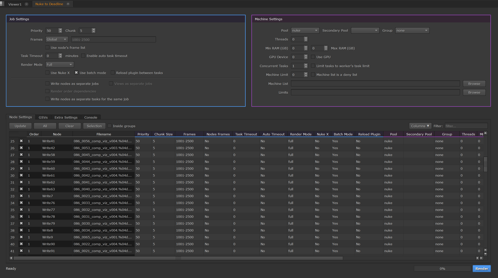

# nk2dl-gui

Welcome to `nk2dl-gui`, a set of GUI components for submitting nukescripts to Thinkbox Deadline from The Fuundry's Nuke. 

## Getting started

- Install the [nk2dl-core](https://github.com/artandmath/nk2dl-core) python module if not done so already.
- Read the [documentation](http://artandmath.github.io/nk2dl-gui) to get `nk2dl-gui` up and running.

## License

[MIT License](./LICENSE)

## Contributing

[Guidelines for contributing to the project](./docs/contributing.md)
