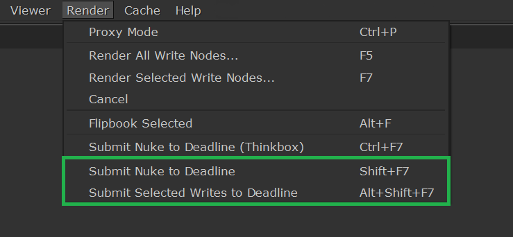

# Installation

## System Requirements
- **Operating System**: Windows 10 (currently tested only on Windows; Testing Linux and MacOS support planned. Linux and MacOS may already work)
- **Nuke**: Compatible with Nuke 13+ (Nuke 15.2+ required for Graph Scope Variables)
- **Deadline**: Thinkbox Deadline 10+ with Repository access
- **Python Version**: Python 3.7+
- **Python Dependencies**: `nk2dl` python module and its dependencies

## 1. Install Dependencies

Follow the [`nk2dl` Installation Guide](https://artandmath.github.io/nk2dl/installation.html) to install the `nk2dl` python module and its dependencies.

## 2. Download

`nk2dl-gui` can be downloaded from [source](#download-from-source) or from a [point release](#download-from-release).

### Download from source 
From the shell:
```bash
git clone https://github.com/artandmath/nk2dl-gui.git
cd nk2dl-gui
```
### Download from release
- Alternatively `nk2dl-gui` can be installed from a release.
- [Download the source code from a release](https://github.com/artandmath/nk2dl-gui/releases). 
- Unzip the source code.

From the shell:
```
cd /path/to/nk2dl-gui-0.1.x-alpha
```

## 3. Install for a single user or multiple users in Nuke

### Install for Nuke GUI, single user (.nuke method)

- Copy the folder `nk2dl_gui` from `src` into the user's `.nuke` folder.

- The `.nuke` folder will contain the following structure

```bash
~/.nuke/
 ├─ Deadline/
 ├─ nk2dl/
 ├─ nk2dl_gui/
 ├─ yaml/
 ├─ init.py
 ├─ menu.py
 │
etc
```
### Install for Nuke GUI, multiple users (init.py method)

- Copy the `nk2dl_gui` folder from `src` to a location available to all users.
- If necessary, add the location to an init.py file available to Nuke during the launch of your pipeline:

```python
# Use nuke.pluginAddPath()
nuke.pluginAddPath('/path/to/parent/folder/containing/nk2dl_gui')

# Or append/insert to sys.path
import sys
sys.path.insert(0, '/path/to/parent/folder/containing/nk2dl_gui')
```

## 4. Add nk2dl-gui to menu.py

Add the following line to your `menu.py`:
```python
from nk2dl_gui import setup_gui
```

## 5. Install Metadata Gizmos (optional)

TODO: Convert Grizmos to Gizmos

Metadata nodes will be available as "Grizmos" (aka Groups) from the nodes menu if the Metadata nodea are not installed as Gizmos.

## 6. Verify

- Launch Nuke
- Check the Render menu, it should contain the following two menu items:
  - `Submit Nuke to Deadline`
  - `Submit Selected Writes to Deadline`



